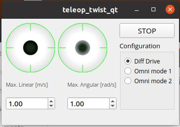

# rosa_robot
This repository contais all the ROS2 packages integrated into ROSA robot.

**Each package has its own README with more detailed information**, but this is an introduction to each one and to their dependencies.

## Instalation and dependencies

Expand to see instalation info

The firsts steps to work with ROSA are install ROS2 Humble [(click this link to go to the tutorial)](https://docs.ros.org/en/humble/Installation.html), and clone this repository.

    cd
    mkdir rosa_ws
    cd rosa_ws
    mkdir src
    cd src
    git clone https://github.com/PabloNH00/rosa_robot.git

Once done, each package has their own dependecies more specified in each README inside them.

As a quick install here are the main dependecies of each one, but it is highly recommended to take a look at the packages READMEs to more info

### gz_rosa_control

    cd rosa_ws
    sudo rosdep init
    rosdep update
    rosdep install --from-paths src/rosa_robot/gz_rosa_control -y --ignore-src

### rosa_audio

For TTS (from [audio_common repository](https://github.com/mgonzs13/audio_common)):

    cd rosa_ws
    sudo apt install portaudio19-dev
    pip3 install -r audio_common/requirements.txt
    rosdep update
    rosdep install --from-paths src/rosa_robot/rosa_audio/TTS --ignore-src -r -y

For STT (from [whisper's page](https://nlpcloud.com/es/how-to-install-and-deploy-whisper-the-best-open-source-alternative-to-google-speech-to-text.html)):

    pip install git+https://github.com/openai/whisper.git
    sudo apt update && sudo apt install ffmpeg

### rosa_camera

To install this package's dependencies it is necessary to follow the [install on ubuntu guide](https://github.com/IntelRealSense/realsense-ros/blob/ros2-master/README.md#installation-on-ubuntu), from the realsense repository.

You need to install librealsense2 to work with the the RGBD camera node. It is a SDK made by realsense, which contains all the libraries to run realsense cameras. It is also guided in the previous link

### rosa_description

    cd rosa_ws
    sudo apt install ros-humble-navigation2 ros-humble-nav2-bringup
    sudo apt install ros-humble-slam-toolbox
    rosdep update
    rosdep install -i --from-path src/rosa_robot/rosa_description

### rosa_firmware

    cd rosa_ws
    sudo apt install ros-humble-asio-cmake-module
    rosdep update
    rosdep install --from-paths src/rosa_robot/rosa_firmware -y --ignore-src

### urg_node2

    cd rosa_ws
    rosdep update
    rosdep install -i --from-paths src/rosa_robot/urg_node2

## gz_rosa_control

Expand to see package's info

[This package](gz_rosa_control/README.md) is only necessary to run ROSA with Gazebo since it contains the omnidirectional plugin for movement in the simulation.
This plugin is already included in the xacro model. 

## rosa_audio

Expand to see package's info

[This package](rosa_audio/README.md) is made as a demo for the STT and TTS. It uses the [audio_common repository,](https://github.com/mgonzs13/audio_common) which uses eSpeak library to the TTS, and the OpenAI library called Whisper for the STT. 

## rosa_camera

Expand to see package's info

This is a package fully cloned from a [realsense repository](https://github.com/IntelRealSense/realsense-ros/tree/ros2-master) and used to launch RGBD camera nodes.
To use this it is necessary to strictly follow the installation guide, both the ROS2 package and the realsense library.

## rosa_description

Expand to see package's info

[This package](rosa_description/README.md) include the xacro model for URDF besides other configuration and launcher files. This is also the main package for navigation and slam, due to its nature linked to the URDF model and its transform tree.

It is composed by differents folders (explained [here](rosa_description/README.md)) with differents requiremets for ROSA to run its functionalities.

## rosa_firmware

Expand to see package's info

[This package](rosa_firmware/rosa_driver/README.md) contains the firmware for the ESP32 to manage the motors and the rosa_driver node, which connect the firmware data to ROS2 to send it mainly the odometry. It also has a [qt_interface](rosa_firmware/qt_interface/README.md) to visualize the encoder and the ESP32 data.

## rosa_launchers_pkg

Expand to see package's info

[This package](rosa_launchers_pkg/README.md) is a shortcut to work with ROSA, because it contains six launchers (three for simulation and three for real ROSA) to execute all the main functionalities at once.

**All the processes that these launchers can run can also be runned with the individual launchers from the rest of the packages if the correct combination is done**

**NONE OF THESE LAUNCHERS ARE USED IN THE ROSA MONITOR**

**TO USE THIS LAUNCHERS DEPENDENCIES OF THE OTHER PACKAGES MUST BE INSTALLED**

## teleop_twist_qt

Expand to see package's info

[This package](teleop_twist_qt/README.md) is a qtcreator application to virtualize a pair of joysticks that publish on the /cmd_vel topic. They have differential and omnidirectional mode of control.

## urg_node2

Expand to see package's info

This is a package obtained from the [Hokuyo GitHub](https://github.com/Hokuyo-aut/urg_node2) to run the UTM-30LX LiDAR. It is modifed like the Hokuyo repository says for a serial connection:

In [urg_node2.launch.py](urg_node2/launch/urg_node2.launch.py)

   config_file_path = os.path.join(
        get_package_share_directory('urg_node2'),
        'config',
        'params_serial.yaml'
    )

In [params_serial.yaml](urg_node2/config/params_serial.yaml)

urg_node2:
  ros__parameters:
    serial_port: '/dev/ttyACM0'
    serial_baud: 115200
    frame_id : 'lidar_sensor_link'

Beside that modifcations, "skip" param in params_serial.yaml is changed to 1. It is because the UTM-30LX capture data at 40Hz and the transform tree has an aproximated value of 20Hz. This param with a value of 1, allows LiDAR to skip a measure and divide by two the frequency. 

