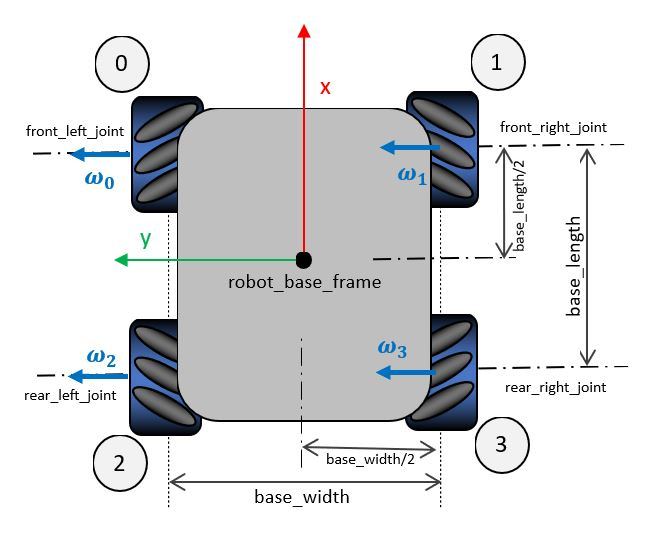

# gazebo\_ros\_omni\_drive

----------

*A omnidirectional (four mechanum wheels ) drive plugin for gazebo. Based on the diffdrive plugin and planar move plugin.

*The planar move used includes an interesting correction made by F.M. Rico <https://github.com/ros-simulation/gazebo_ros_pkgs/pull/1504/commits> in 2023

*The plugin is partially operative It computes de Fk and IK and uses a simplified velocity controller for the wheels if used. tf broadcasting of wheels is made by default. 

*Although the plugin code uses only the gazebo_ros_omni_drive.(cpp,hpp) files, the repo also includes the sources used for the plugin implementation.

*prof.: Miguel Hernando (2023)*

[](https://youtu.be/V3p5xCgLpGY)

### install:

  cd rosa_ws()
  sudo rosdep init
  rosdep update
  rosdep install --from-paths src/rosa_robot/gz_rosa_control -y --ignore-src

### LIB REQUIREMENTS

    sudo apt install ros-humble-gazebo-dev 
    sudo apt install ros-humble-gazebo-msgs 
    sudo apt install ros-humble-gazebo-ros


<https://github.com/mhernando/gz_rosa_control>

 
### PLUGIN PARAMETERS:



The figure shows the main parameters needed for the similation of omnidirectional drive and also de used conventions.

- commandTopic: Twist topic used as input
- odometryTopic: topic where publish the odometry data
- odometryFrame: the TF frame for odometry 
- odometryRate: (double) Odometry frecuency update [Hz]
- robotBaseFrame: base frame of the robot
- wheel_radius: All the 4 wheels have the same radius [meters]
- base_lenght: (check figure) distance between front and rear wheels [meters]
- base_width: (check figure) distance between left and right wheels [meters]
- front_left_joint: joint name of the rotational joint of the referenced wheel
- rear_left_joint: joint name of the rotational joint of the referenced wheel
- front_right_wheel: joint name of the rotational joint of the referenced wheel
- rear_right_wheel: joint name of the rotational joint of the referenced wheel
- wheel_max_speed: maximun allowed ratational speed [rad/sec] 
- wheel_acceleration: angular acceleration of the wheel [rad/sec^2]
- joint_config: a string with 4 integer values (1 or -1). Correction of the joint rotational direction. Its useful to allow the use of the same wheel component for all the wheels but controlling them with a virtual angular velocity. Internally, de FK and the IK, consider a positive velocity of the wheels when they try to move the robot forward.   
 

### Example of use in a urdf file:

```xml
<gazebo>
    <plugin name="rosa_controller" filename="libgazebo_ros_omni_drive.so">
      <commandTopic>cmd_vel</commandTopic>
      <odometryTopic>odom</odometryTopic>
      <odometryFrame>odom</odometryFrame>
      <odometryRate>20.0</odometryRate>
      <robotBaseFrame>base_footprint</robotBaseFrame>
      <wheel_radius>0.075</wheel_radius>
      <base_length>0.65</base_length>
      <base_width>0.65</base_width>
      <front_left_joint>wheel_front_left_joint</front_left_joint>
      <front_right_joint>wheel_front_right_joint</front_right_joint>
      <rear_left_joint>wheel_back_left_joint</rear_left_joint>
      <rear_right_joint>wheel_back_right_joint</rear_right_joint>
      <wheel_max_speed> 20.0 </wheel_max_speed>
      <wheel_acceleration> 10.0</wheel_acceleration>
      <joint_config>1 1 -1 -1</joint_config>
    </plugin>
  </gazebo>
```
