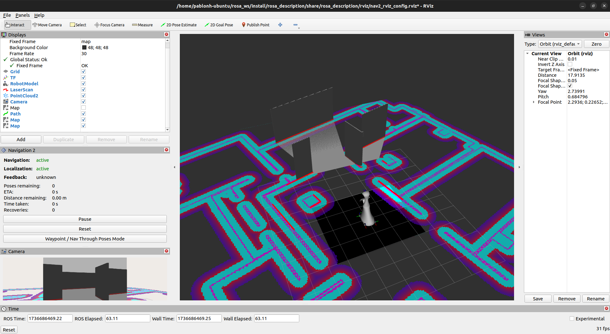
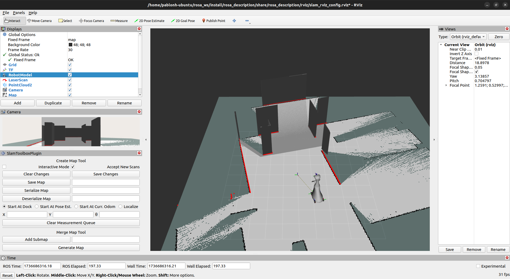

# rosa_description

This include the xacro model for URDF besides other configuration and launcher files. This is also the main package for navigation and slam, due to its nature linked to the URDF model and its transform tree, although it could be launched in different ways.

## Install dependencies

    cd rosa_ws
    sudo apt install ros-humble-navigation2 ros-humble-nav2-bringup
    sudo apt install ros-humble-slam-toolbox
    rosdep install -i --from-path src/rosa_robot/rosa_description

## config/
<details>
<summary>Expand to see folder's info</summary>

This folder contains the parameters file for navigation and SLAM. Here are the explanation for the most important and changed parameters for the development.

**load_pre_mapped_params_online_async.yaml is not used and may be outdated, but it is in the folder for possible future uses**

### slam_params.yaml

This params file is a copy paste from the "slam_toolbox/config/mapper_params_online_async.yaml" (same as slam_toolbox/config/mapper_params_online_sync.yaml), but is included in the package to be modified easily if necessary.

### nav2_params_yaml

The default params file from nav2_bringup is modified for this project rquirements. Mainly to change from differential to omnidirectional movement, so most of the changes are refered to velocities and accelerations, but also to adapt the navigation to the robot size, components and enviroment.

Here are some of the most important changes. If no coment is following the value it is full added, either the comented value is the default one:

```yaml
amcl:
  ros__parameters:
    laser_max_range: 30.0 #100
    robot_model_type: "nav2_amcl::OmniMotionModel" #"nav2_amcl::DifferentialMotionModel"
    set_initial_pose: true
    initial_pose: { x: 0.0, y: 0.0, z: 0.0, yaw: 0.0 }

controller_server:
  ros__parameters:
    min_y_velocity_threshold: 0.001
    FollowPath:
      min_vel_x: -0.05 #0.0
      min_vel_y: -0.15 #0.0
      max_vel_x: 0.15 #0.26
      max_vel_y: 0.15 #0.0
      max_vel_theta: 0.25 #1.0
      min_speed_xy: 0.001 #0.0
      max_speed_xy: 0.15 #0.26
      min_speed_theta: 0.01 #0.0
      acc_lim_y: 2.5 #0.0
      decel_lim_y: -2.5 #0.0
      vy_samples: 40 #5
      critics: ["RotateToGoal", "Oscillation", "BaseObstacle", "GoalAlign", "PathAlign", "PathDist", "GoalDist", "Twirling"] #Same without "Twirling"

local_costmap:
  local_costmap:
    ros__parameters:
      footprint: "[[0.35, 0.295], [0.35, -0.295], [-0.35, -0.295], [-0.35, 0.295]]" #robot_radius: 0.46

map_server:
  ros__parameters:
    use_sim_time: True
    # Overridden in launch by the "map" launch configuration or provided default value.
    # To use in yaml, remove the default "map" value in the tb3_simulation_launch.py file & provide full path to map below.
    yaml_filename: "../gz_slam_map/gaz_world"


behavior_server:
  ros__parameters:
    max_rotational_vel: 0.25 #1.0
    min_rotational_vel: 0.001 #0.4

velocity_smoother:
  ros__parameters:
    max_velocity: [0.15, 0.15, 0.25] #[0.26, 0.0, 1.0]
    min_velocity: [-0.05, -0.15, -0.25] #[-0.26, 0.0, -1.0]
    max_accel: [1.0, 1.0, 1.5] #[2.5, 0.0, 3.2]
    max_decel: [-1.0, -1.0, -1.5] #[-2.5, 0.0, -3.2]
```
Other parameters such as inflation layers of the maps are also modified but must be adjusted depending on the purpose and enviroment.

As shown in the modifications, most of them are related to allow horizontal movement, decreasing minimum thresholds and increasing maximum velocities.

DWBLocalPlanner is selected due to its performance during tests.

Controller frequency is set to 20 although odom joint has a mean frequency of 16, it is due to the LiDAR's measure frequency, because it is also 20 (40 by default 20 with skip parameter) and has to match the controller frequency to locate the robot accurately.

</details>

## description/rosa/
<details>
<summary>Expand to see folder's info</summary>

In this folder is located the xacro elements to represent ROSA in URDF format, with their Gazebo plugin if necessary.
Includes a "meshes/" folder with the mesh data for the LiDAR, camera, wheels and robot body.

The URDF model stablishes a transform tree headed by "base_footprint" frame, which correspond to "base_footprint" link.

### Links

- **base_footprint:** Auxiliar link to be the header frame of the URDF tf tree.
- **base_link:** Used to support the fixed transforms of components.
- **chasis:** Represents the body of ROSA.
- **lidar_sensor_link:** Represents the Hokuyo LiDAR.
- **camera_link:** Represents the Realsense RGBD camera. This is the top part of the transforms structure derivated from the specifications of RGBD's cameras.
- **wheel_front_left_link** & **wheel_front_right_link** & **wheel_back_left_link** & **wheel_fback_right_link:** Represent the four mecanum wheels of ROSA.

### Frames and joints


Frames from top to bottom:
- **base_footprint:** 
  - Parent with fixed joint with **base_link**
  - Parent with continuous joint with the four **omni wheels**
- **base_link:**
  - Child with fixed joint with **base_footprint**
  - Parent with fixed joint with **chasis**
  - Parent with fixed joint with **lidar_sensor_link**
  - Parent with fixed joint with **camera_link**
 
- **wheel_front_left_link** & **wheel_front_right_link** & **wheel_back_left_link** & **wheel_fback_right_link:** 
  - Child with continuous joint with **base_link**
- **chasis:**
  - Child with fixed joint with **base_link**
- **lidar_sensor_link:**
  - Child with fixed joint with **base_link**
- **camera_link:**
  - Child with fixed joint with **base_link**
  - Parent with fixed joint with **camera_depth_frame**
  - Parent with fixed joint with **camera_color_frame**
- **camera_depth_frame:** 
  - Child with fixed joint with **camera_link**
  - Parent with fixed joint with **camera_depth_optical_frame:** Rotated on axis {-pi/2} 0 {-pi/2} due to the RGBD's specifications
- **camera_color_frame:** 
  - Child with fixed joint with **camera_link**
  - Parent with fixed joint with **camera_color_optical_frame:** Rotated on axis {-pi/2} 0 {-pi/2} due to the RGBD's specifications
- **camera_depth_optical_frame:** 
  - Child with fixed joint with **camera_depth_frame**
- **camera_color_frame:** 
  - Child with fixed joint with **camera_color_frame**

### Plugins and Gazebo

For the simulation in Gazebo there are plugins included in the corresponding xacros. 

lidar_sensor.xacro uses a type "ray" plugin configured to emulate the real hokuyo LiDAR.

realsense_d435.xacro uses a type "depth" plugin configured to emulate the real camera.

For the omni_wheel.xacro the omnidirectional movement plugin is located in the [gz_rosa_control](../gz_rosa_control/) package, also included in the project. This plugin creates a transform for the odometry when simulating with Gazebo


</details>

## gz_slam_map/
<details>
<summary>Expand to see folder's info</summary>

This folder contains all the files generated after map the gazebo world. It is set as default map for navigation in the launchers (gaz_wolrd.yaml)


</details>

## launch/
<details>
<summary>Expand to see folder's info</summary>

This folder contains ROS2 launchers created for map and navigate with ROSA robot. Most of them can be executed with differents arguments depending on the objective and they will launch processes on different ways to simulate on Gazebo or run the real robot. 

**navigation_launch.py and slam_launch.py are not used and may be outdated, but they are in the folder for possible future uses**

### rosa_gazebo_launch.py

Launches Gazebo program with the ROS2 parameter "use_sim_time" set to true. This launcher execute "spawn_entity.py", run the "robot_state_publisher" and load the [URDF model](description/rosa/).

Gazebo opens with preloaded URDF a world, which correspond to [pal_office.world](worlds/pal_office.world)

    ros2 launch rosa_description rosa_gazebo_launch.py


This launcher creates a joint between odom and base_footprint due to the [gz_rosa_control](../gz_rosa_control/README.md) package plugin

## rosa_urdf_launch.py

Load URDF model to work with ROS2 using real ROSA. Set "use_sim_time" param to false and run "robot_state_publisher" with the [xacro model](description/rosa/).

    ros2 launch rosa_description rosa_urdf_launch.py

This launcher does not create a joint between odom and base_footprint so [rosa_driver](../rosa_firmware/rosa_driver/README.md) node from rosa_firmware package must be launcher for this purpose.

## rosa_nav_slam_launch.py

It will run "bringup_launch.py", it will also execute a pre-configured rviz2 with all necessary components. This launcher is supposed to be used both for SLAM and for navigation. Localization with AMCL wil always be active to help the robot to map and to navigate.

It is necessary an active joint between the "odom" and "base_footprint" frames, so **one of the previous launcher should be executed first with the rosa_driver node if using the real robot**

    ros2 launch rosa_description rosa_nav_slam_launch.py

### Launch Arguments

These are the specific launcher's arguments and their default value

* use_sim_time: false
* slam: False
* slam_params: [slam_params.yaml](config/slam_params.yaml)
* params_file: [nav2_params.yaml](config/nav2_params.yaml)
* map: gaz_world.yaml

**Lidar topic /scan should always be active to properly navigate or doing SLAM**

### SLAM
This way of launching rosa_nav_slam_launch.py execute **bringup_launch.py,** from the nav2_bringup package, which launch **slam_launch.py** using **online_sync_launch.py** from the slam_toolbox package.

    ros2 launch rosa_description rosa_nav_slam_launch.py slam:=True

If you are using Gazebo and **not in the NUC of the robot**, it is recomended to edit slam_launch.py to launch online_async_launch.py. It is due to the async launcher is faster at the cost of a loss of quality on the map that does not really affect in the simulation.

    sudo gedit /opt/ros/humble/share/nav2_bringup/launch/slam_launch.py

Start moving the robot publishing in /cmd_vel or using goal pose and save the map using the SLAM plug-in openned in rviz2 
* "save map" for .pgm and .yaml (necessary for navigation)
* "serialize map" for serialized version (.data and .posegraph)

Once you have your map files you can set it for navigation using launch arguments:

    ros2 launch rosa_description rosa_nav_slam_launch.py map:=(map.yaml path)
    
### Navigation
This way launches **bringup_launch.py,** from the nav2_bringup package.

    ros2 launch rosa_description rosa_nav_slam_launch.py map:=(map.yaml path)

The default map in this launcher is [gaz_world.yaml](gz_slam_map/gaz_world.yaml) and you have to use parameters to change it

The initial pose of the robot is set as a parameter to (0, 0, 0, 0) in [nav2_params.yaml](config/nav2_params.yaml). If it is not accurate set another initial pose using RVIZ.
Start navigation by setting a goal pose. If navigation is working properly, "navigation" and "localization" should be shown as "active" down left the screen.

While the robot is moving the path planned should appear in the RVIZ visualizer. You can stop the navigation using the RVIZ nav2 plugin. You can also interrupt the movement for a moment if working with the real robot by using the remote controller but, either stopping or moving it to another place, the navigation planner will resume the movement to the goal pose once the controller is no loger intervening.

</details>

## rviz/
<details>
<summary>Expand to see folder's info</summary>

Preconfigured rviz configuration for navigation and SLAM with ROSA. 
They are included in the launchers to open rviz with the necessary displays and components to visualize.

### nav2_rviz_config.rviz



Displays included:
 - Grid
 - TF
 - RobotModel
 - LaserScan
 - PointCloud2
 - Camera
 - Map: unactive, for visualize preloaded map
 - Path: for navigation calculated paths
 - Map: for global costmap
 - Map: for local costmap
 - Nav2_rviz_plugin: to visualize navigation status
 
### slam_rviz_config.rviz



Displays included:
 - Grid
 - TF
 - RobotModel
 - LaserScan
 - PointCloud2
 - Camera
 - Map: to visualize map while generating
 - SlamToolboxPlugin: to save generated map

</details>

