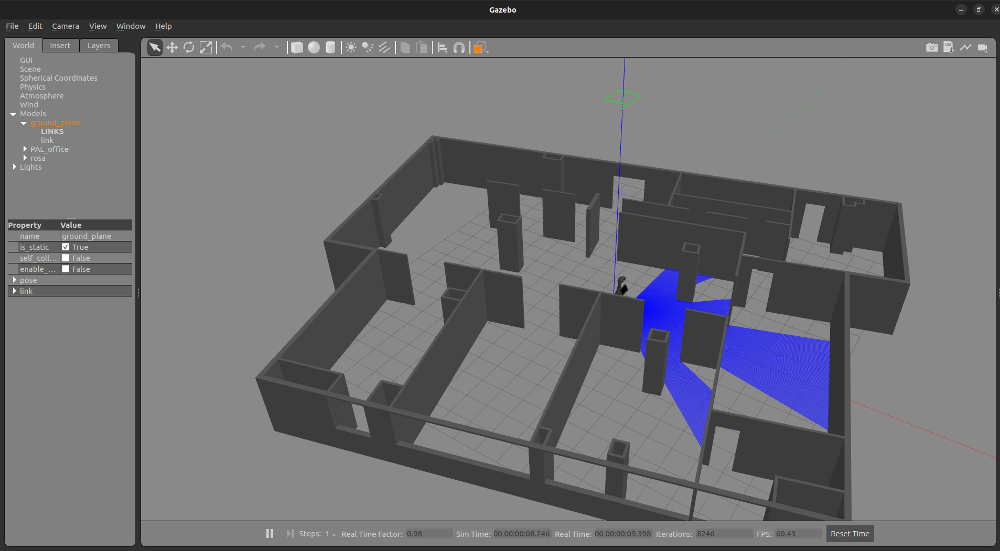

# LAUNCH FOLDER

This folder contains all the ROS2 launchers created for ROSA robot. Most of them can be executed with differents arguments depending on the objective and they will launch processes on different ways to simulate on Gazebo or run the real robot. 

## rosa_gazebo_launch.py

Launches Gazebo program with the ROS2 parameter "use_sim_time" set to true. This launcher execute "spawn_entity.py", run the "robot_state_publisher" and load the URDF model from "/description/rosa".

Gazebo opens with preloaded URDF a world, which correspond to "/worlds/pal_office.world"

## rosa_urdf_launch.py

Load URDF model to work with ROS2 using real ROSA. Set "use_sim_time" param to false and run "robot_state_publisher" with "/description/rosa" xacro model.

## rosa_nav_slam_launch.py

It will run "bringup_launch.py", it will also execute a pre-configured rviz2 with all necessary components. This launcher is supposed to be used both for SLAM and for navigation. Localization with AMCL wil always be active to help the robot to map and to navigate.

It is necessary an active joint between the "odom" and "base_footprint" frames, so one of the previous launcher should be executed first

### Launch Arguments

These are the specific launcher's arguments and their default value

* use_sim_time: false
* slam: False
* slam_params: mapper_params_online_async.yaml
* params_file: nav2_params.yaml
* map: gaz_world.yaml
* lidar: false

If lidar is "True" launcher will run "urg_node2.launch.py" from the urg_node2 package, that should be built in the same workspace. ** Lidar should always be active to properly navigate or doing SLAM **

### SLAM

Start moving the robot publishing in /cmd_vel or using goal pose and save the map using the SLAM plug-in openned in rviz2 
* "save map" for .pgm and .yaml (necessary for navigation)
* "serialize map" for serialized version (.data and .posegraph)

Once you have your map files you can set it for navigation using launch arguments or by modifying "nav2_params.yaml" and changing "yaml_filename" param with your path to the map file

    map_server:
        ros__parameters:
            use_sim_time: True
            # Overridden in launch by the "map" launch configuration or provided default value.
            # To use in yaml, remove the default "map" value in the tb3_simulation_launch.py file & provide full path to map below.
            yaml_filename: "/home/pablonh-ubuntu/tfg_ROSA_ws/gaz_world"
    
### Navigation
