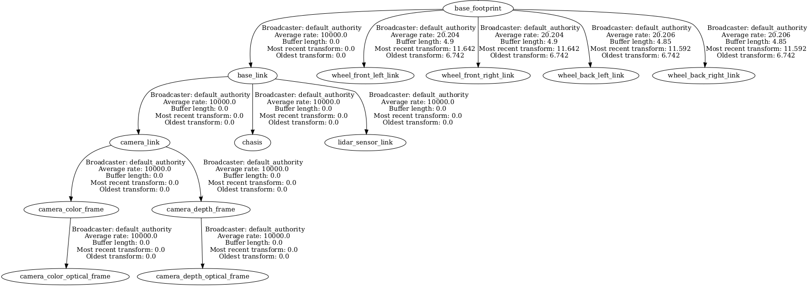

# ROSA DESCRIPTION

In this folder is located the xacro elements to represent ROSA in URDF format, with their Gazebo plugin if necessary.
Includes a "/meshes" folder with the mesh data for the LiDAR, camera, wheels and robot body.

The URDF model stablishes a transform tree headed by "base_footprint" frame, which correspond to "base_footprint" link.

## Links

- **base_footprint:** Auxiliar link to be the header frame of the URDF tf tree.
- **base_link:** Used to support the fixed transforms of components.
- **chasis:** Represents the body of ROSA.
- **lidar_sensor_link:** Represents the Hokuyo LiDAR.
- **camera_link:** Represents the Realsense RGBD camera. This is the top part of the transforms structure derivated from the specifications of RGBD's cameras.
- **wheel_front_left_link** & **wheel_front_right_link** & **wheel_back_left_link** & **wheel_fback_right_link:** Represent the four mecanum wheels of ROSA.

## Frames and joints

Frames fom top to bottom:
- **base_footprint:** 
  - Parent with fixed joint with **base_link**
  - Parent with continuous joint with the four **omni wheels**
- **base_link:**
  - Child with fixed joint with **base_footprint**
  - Parent with fixed joint with **chasis**
  - Parent with fixed joint with **lidar_sensor_link**
  - Parent with fixed joint with **camera_link**
 
- **wheel_front_left_link** & **wheel_front_right_link** & **wheel_back_left_link** & **wheel_fback_right_link:** 
  - Child with continuous joint with **base_link**
- **chasis:**
  - Child with fixed joint with **base_link**
- **lidar_sensor_link:**
  - Child with fixed joint with **base_link**
- **camera_link:**
  - Child with fixed joint with **base_link**
  - Parent with fixed joint with **camera_depth_frame**
  - Parent with fixed joint with **camera_color_frame**
- **camera_depth_frame:** 
  - Child with fixed joint with **camera_link**
  - Parent with fixed joint with **camera_depth_optical_frame:** Rotated on axis {-pi/2} 0 {-pi/2} due to the RGBD's specifications
- **camera_color_frame:** 
  - Child with fixed joint with **camera_link**
  - Parent with fixed joint with **camera_color_optical_frame:** Rotated on axis {-pi/2} 0 {-pi/2} due to the RGBD's specifications
- **camera_depth_optical_frame:** 
  - Child with fixed joint with **camera_depth_frame**
- **camera_color_frame:** 
  - Child with fixed joint with **camera_color_frame**

## Plugins and Gazebo

For the simulation in Gazebo there are plugins included in the corresponding xacros. 

lidar_sensor.xacro uses a type "ray" plugin configured to emulate the real hokuyo LiDAR.

realsense_d435.xacro uses a type "depth" plugin configured to emulate the real camera.

For the omni_wheel.xacro the omnidirectional movement plugin is located in the gz_rosa_control package, also included in the project.
