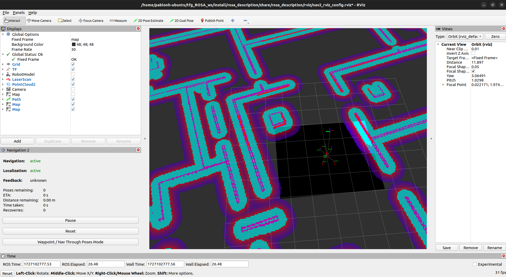
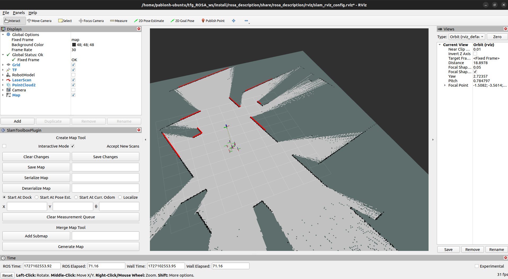

# rviz configuration

Preconfigured rviz configuration for navigation and SLAM with ROSA. 
They are included in the launchers to open rviz with the necessary displays and components to visualize.

## nav2_rviz_config.rviz

Displays included:
 - Grid
 - TF
 - RobotModel
 - LaserScan
 - PointCloud2
 - Camera
 - Map: unactive, for visualize preloaded map
 - Path: for navigation calculated paths
 - Map: for global costmap
 - Map: for local costmap
 - Nav2_rviz_plugin: to visualize navigation status
 
## slam_rviz_config.rviz

Displays included:
 - Grid
 - TF
 - RobotModel
 - LaserScan
 - PointCloud2
 - Camera
 - Map: to visualize map while generating
 - SlamToolboxPlugin: to save generated map
